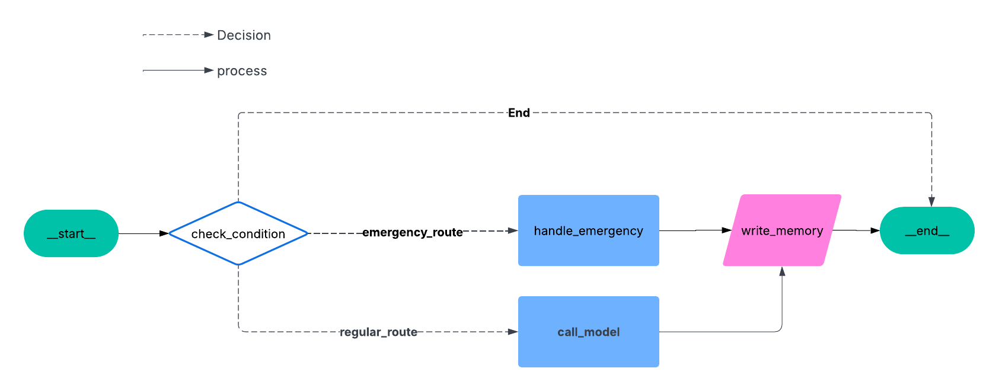

# 🏥 Good Health AI Assistant – Smart Medical Chatbot with LangGraph & GPT

An intelligent, memory-aware conversational assistant for **Good Health Clinic**, built with **LangGraph**, **LangChain**, and **OpenAI GPT**. This system routes patient queries, detects emergencies, manages appointments, and updates medical records — all through natural multi-turn conversations.



---

## ✨ Key Features

* 🤖 **AI-Powered Appointment Scheduling**
* 👤 **Patient Profile Management** (history, allergies, treatments)
* 🚨 **Emergency Detection & Alert System**
* 💬 **Multi-turn Memory Conversations**
* 🧠 **LangGraph-Based Decision Routing**

---

## 🧩 How It Works

### 🔹 `check_condition()`

Determines the route of conversation:

* Routes to `handle_emergency()` if message contains **"emergency"**
* Otherwise, calls `call_model()` for regular processing

### 🔹 `call_model()`

* Retrieves patient data
* Generates GPT-based responses contextualized with history

### 🔹 `handle_emergency()`

* Delivers urgent care instructions instantly

### 🔹 `write_memory()`

* Updates and persists medical records securely

---

## ⚙️ Setup & Installation

### 1️⃣ Clone the Repo

```bash
git clone https://github.com/aimaster-dev/medical-ai-assistant
cd medical-ai-assistant
```

### 2️⃣ Install Dependencies

Make sure you're using Python 3.8+

```bash
pip install -r requirements.txt
```

### 3️⃣ Configure Environment Variables

Create a `.env` file:

```env
OPENAI_API_KEY=your-api-key-here
```

---

## 🚀 Running the Assistant

To launch the chatbot:

```bash
python main.py
```

### 💡 Example Interaction

Routine Check-up:

```
User: I need to book a follow-up appointment.
Assistant: Hello Taher! I can help you schedule a check-up. When are you available?
```

Emergency:

```
User: This is an emergency! I’m having severe chest pain.
Assistant: We've detected an emergency. Please call emergency services or our 24/7 urgent line: +43 00 00 00.
```

---

## 🧠 Tech Stack

| Tool              | Purpose                              |
| ----------------- | ------------------------------------ |
| **LangGraph**     | Graph-based conversational routing   |
| **LangChain**     | LLM + Memory integration             |
| **OpenAI GPT**    | Natural language response generation |
| **Python**        | Backend implementation               |
| **InMemoryStore** | Persistent session-based memory      |

---

## 👨‍💻 Maintainer

**Ying Zhou**
📧 [zying1309@gmail.com](mailto:zying1309@gmail.com)

> Contributions welcome! Fork the repo and submit a pull request 🚀

---

## 📝 License

This project is licensed under the **MIT License**.
